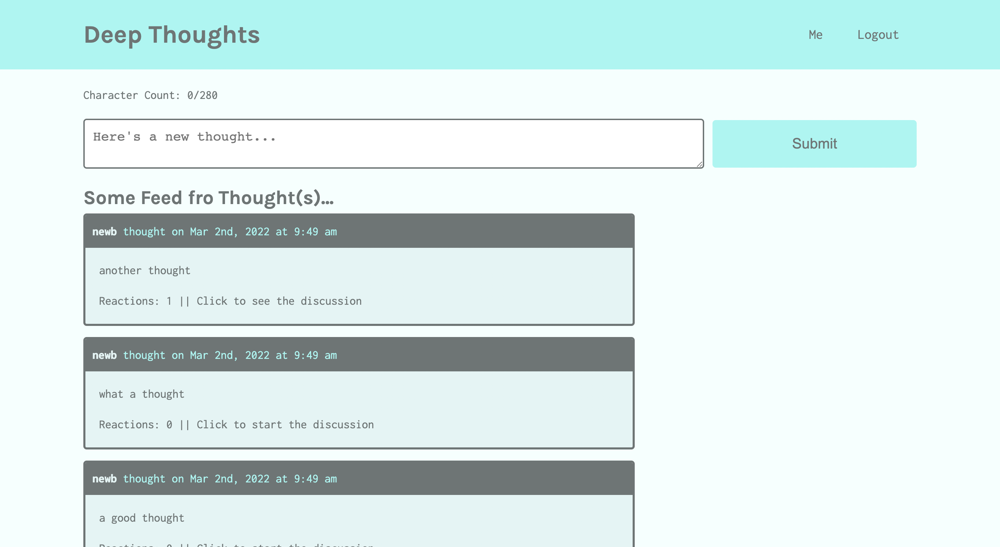

# Deep Thought
  
  
   
  
                       
   

  ## TABLE OF CONTENTS

  

  [Description](#description) *
  [Installation](#installation) *
  [Usage](#usage) *
  [Questions](#questions) *
  [License](#license)

   

    
  
   

  ## Description

  

  This a social media thought-posting app built with React.
    
  Deployment: (https://dry-mesa-47445.herokuapp.com/)
   
  Repo: (https://github.com/sihayah/deep-thoughts)

  

  ## Installation

  
  
  Navigate to deployment at Heroku.

   

## Usage

  

  To use this app, sign-up. Create thoughts from the homepage or your user profile. Click on thoughts on to add reactions. Navigate to other users' profiles to add them as friends.

   

  ## Questions

  

  For any further inquiries, please contact me via gitHub: [(sihayah)](https://github.com/sihayah) or email: sihayaharris@gmail.com

   

  

  ## License

  
  
  [click here for more information about  license.]()
  

   
   
